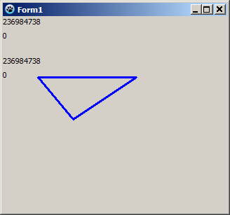
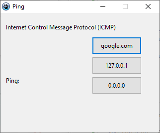
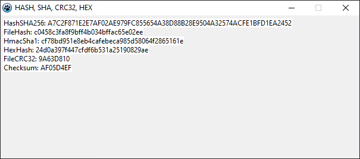

# LazarusIDETip
LazarusIDETip

 

Keyword:

- SimpleIPC :

   - Communication between application
     
   - Auto Message
     
   - MessageQueued
      
   - PeekMessage

- Loop run using Application.OnIdle events

- Fix bug SIGSEGV error

- GetTickCount 32bit / 64bit

- Repaint, Clear before repaint buffer

- No blinking cursor

- Speed blinking cursor

- Hide blinking cursor

- Show blinking cursor

- If showing form

- inc to stream

- Steam to image

- Load record from file

- Save record to file

- Save record to file using stream

- Example DLL

- Mouse with graphics
- Internet Control Message Protocol (ICMP)

EasterEgg got from https://forum.lazarus.freepascal.org/index.php?topic=44067.0
